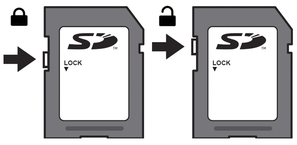
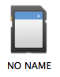
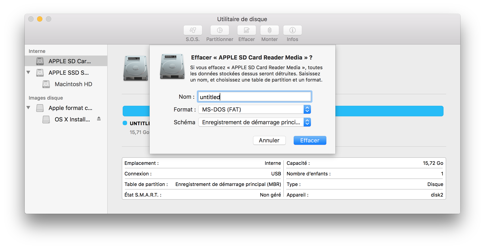
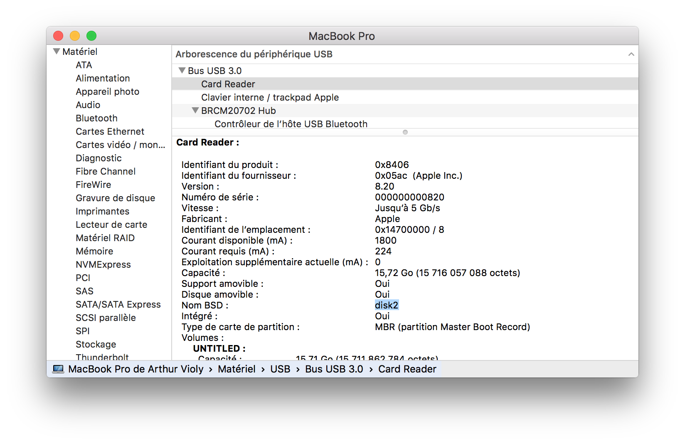

# préparer une carte SD pour RaspberryPI

## introduction

ce tutoriel indiques les étapes pour formater une carte sd en installant une image de Raspbian Jessy. Il a été fait sous Mac OS X (10.11).
Il est inspiré [du site officiel raspberry](https://www.raspberrypi.org/documentation/installation/installing-images/mac.md)

## choix de l’os pour RaspberryPI

j'ai choisi d'installer Raspbian Wheezy, mais vous pouvez télécharger d’autres OS, souvent mis à jour.
les officiels sont disponibles à cette adresse : 
[www.raspberrypi.org/downloads](http://www.raspberrypi.org/downloads)

une fois l’OS choisi, téléchargé une archive, et obtenez le fichier **image**, avec une extension .img 

par exemple, pour raspbian wheezy, on télécharge un fichier .zip qui une fois dézippé, renvoit uniquement un fichier .img ! c'est on ne peut plus simple !

## choix de la carte

sur le système raspberry PI, le choix d'une bonne carte est primordiale car celle-ci sera votre disque dur. il est donc préférable d’avoir un minimum d’espace, et un taux de transfert conscéquent. dans mon cas, j’utilise une SD de 8Gb avec une vitesse de transfert 400x. j'ai trouvé la carte chez un fournisseur photo.

## insertion de la carte 

avant même de l’insérer il faudra veiller que la carte SD n’est pas verrouillée.

 
quand j’insère la carte (neuve), elle est bien montée par mon mac, je la vois dans le finder ou sur le bureau, chez moi elle s’appelle `NO NAME`. 

## formater la carte et installer l'image disque

l’objectif est de formater la carte, pour installer l'OS sur la carte. 

** cette commande supprimera définitivement toutes les données de la carte SD. **

Lancer l’utilitaire de disque et formaté la carte en **MS-DOS (FAT)** `FAT-32`

Ensuite, identifier le code du lecteur de carte SD. Pour se faire, lancer `À propos de ce Mac` puis `Rapport Système` puis `USB`. Il faudra alors identifier le `Nom BSD` avec le nombre associé qu'il faudra retenir : 

	ici c’est disk2 
	le nombre associé est 2
	
Dans l’application `Terminal`, on va démonté le Volume.
il faut d’abord identifier le disque

	df -h

Apparait alors une liste

	Filesystem                          Size   Used  Avail Capacity   iused   ifree %iused  Mounted on
	/dev/disk1                         465Gi  448Gi   16Gi    97% 117528314 4309284   96%   /
	devfs                              190Ki  190Ki    0Bi   100%       657       0  100%   /dev
	map -hosts                           0Bi    0Bi    0Bi   100%         0       0  100%   /net
	map auto_home                        0Bi    0Bi    0Bi   100%         0       0  100%   /home
	localhost:/VI1Vaq2Dgz-lRUYvPCs5B8  465Gi  465Gi    0Bi   100%         0       0  100%   /Volumes/MobileBackups
	/dev/disk3s2                       4.7Gi  4.6Gi  110Mi    98%   1199356   28162   98%   /Volumes/OS X Install ESD
	/dev/disk2s1                        15Gi  2.4Mi   15Gi     1%         0       0  100%   /Volumes/UNTITLED	
	
On identifie le disque puis, on le démonte avec cette commande :

	diskutil unmount /dev/disk2s1	

### transfert de l’image disque

Ensuite on peut (enfin!) chargé l’image sur la carte. identifier le chemin du fichier `.img` de l’image Raspbian. Aussi l’identifiant final est obtenu sur ce modèle `/dev/rdisk` + `n`. Il faudra saisir votre mot de passe (il n'est pas visible lors de la frappe.) Attention, cette étape va prendre un certain temps — plusieurs minutes.
 
	sudo dd bs=1m if=~/2016-09-23-raspbian-jessie.img of=/dev/rdisk2

Il est possible d’obtenir la progression avec la combinaison `CTRL`+`t`

	load: 1.68  cmd: dd 14146 uninterruptible 0.01u 1.66s
	3344+0 records in
	3343+0 records out
	3505389568 bytes transferred in 320.404427 secs (10940515 bytes/sec)	
### c’est presque fini

éjectez ensuite la carte avec la commande suivante :

	diskutil eject /dev/disk2s1

et voilà c'est prêt :

	Disk /dev/disk2s1 ejected

sortez la carte du lecteur, mettez la dans votre raspberry et démarrez le !

