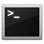

# préparer une carte SD pour RaspberryPI

## introduction

ce tutoriel indiques les étapes pour formater une carte sd en installant une image de Raspbian Wheezy. Il a été fait sous Mac OS X (10.9)

## choix de l’os pour RaspberryPI

j'ai choisi d'installer Raspbian Wheezy, mais vous pouvez télécharger d’autres OS, souvent mis à jour.
les officiels sont disponibles à cette adresse : 
[www.raspberrypi.org/downloads](http://www.raspberrypi.org/downloads)

une fois l’OS choisi, téléchargé une archive, et obtenez le fichier **image**, avec une extension .img 

par exemple, pour raspbian wheezy, on télécharge un fichier .zip qui une fois dézippé, renvoit uniquement un fichier .img ! c'est on ne peut plus simple !

## choix de la carte

sur le système raspberry PI, le choix d'une bonne carte est primordiale car celle-ci sera votre disque dur. il est donc préférable d’avoir un minimum d’espace, et un taux de transfert conscéquent. dans mon cas, j’utilise une SD de 8Gb avec une vitesse de transfert 400x. j'ai trouvé la carte chez un fournisseur photo.

## insertion de la carte 

avant même de l’insérer il faudra veiller que la carte SD n’est pas verrouillée.


 
quand j’insère la carte (neuve), elle est bien montée par mon mac, je la vois dans le finder ou sur le bureau, chez moi elle s’appelle `NO NAME`. 


## formater la carte et installer l'image disque

l’objectif est de formater la carte, pour installer l'OS sur la carte. 

** cette commande supprimera définitivement toutes les données de la carte SD. **

ouvrez le terminal (rechercher `terminal` dans spotlight) 



une fois le terminal lancé, tapez la commande suivante, puis `Entrer` pour executer la commande. 

```
df -h
```
cette commande affiche la liste des différents volumes montés sur votre ordinateur. 
une liste de ce type doit apparaitre. 

```
Filesystem                          Size   Used  Avail Capacity  iused   ifree %iused  Mounted on
/dev/disk0s2                       297Gi  267Gi   30Gi    90% 70051250 7881652   90%   /
devfs                              188Ki  188Ki    0Bi   100%      649       0  100%   /dev
map -hosts                           0Bi    0Bi    0Bi   100%        0       0  100%   /net
map auto_home                        0Bi    0Bi    0Bi   100%        0       0  100%   /home
localhost:/LEAJnl_Whjo--ZIr7qHvaz  297Gi  297Gi    0Bi   100%        0       0  100%   /Volumes/MobileBackups
/dev/disk2s1                       7.5Gi   32Ki  7.5Gi     1%        0       0  100%   /Volumes/NO NAME
```

cherchez la ligne qui correspond à la carte mémoire. moi, on l’a vu, c'est `NO NAME`. 
son identifiant dans la collone `Filesystem` est `/dev/disk2s1`. 
vous pouvez copier cet identifiant de disque car il nous servira par la suite. 

on va maintenant démonter la carte SD (virtuellement !) 
executez donc la commande suivante (remplacez `/dev/disk2s1` par votre identifiant de disque) : 

```
diskutil unmount /dev/disk2s1
```
le disque est maintenant démonté, le message suivant devrait s'afficher 

```
Volume NO NAME on disk2s1 unmounted
```
on va maintenant transferer le fichier **d'image disque ** de l’OS téléchargé plus haut

```
sudo dd bs=1m if=/Users/arthurvioly/Documents/RaspberryPi/2014-01-07-wheezy-raspbian.img of=/dev/disk2s1
```
il faudra évidement saisir le chemin du fichier image sur votre ordinateur. vous pouvez le trouver en faisant `Lire les informations` depuis le finder. 

dans le terminal, la commande `sudo` vous demandera de saisir votre mot de passe systeme. qaund on le tape dans le terminal, il ne s'affiche pas, même pas sous forme d'astérisques. il suffira de faire ENTER pour valider. 

on doit attendre quelques minutes (entre 6 et 15 minutes, suivant la vitesse de transfert vers la carte)… patiente.

on obtient ensuite le résultat suivant dans le terminal. c'est presque fini.

```
475+0 records in
474+0 records out
497025024 bytes transferred in 434.977746 secs (1142645 bytes/sec)
```

éjectez ensuite la carte avec la commande suivante :

```
diskutil eject /dev/disk2s1

```

et voilà c'est prêt :

```
Disk /dev/disk2s1 ejected
```
sortez la carte du lecteur, mettez la dans votre raspberry et démarrez le !

